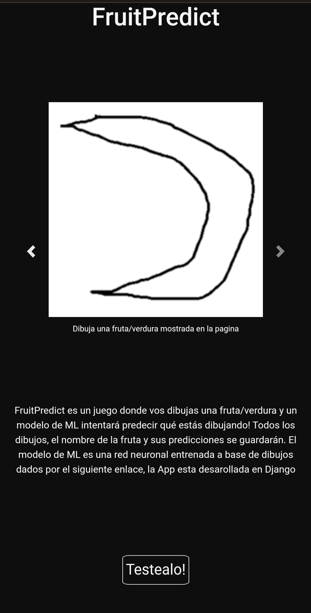

# FruitPredict

Actualmente corriendo en [Railway](https://django-server-production-b4b5.up.railway.app/)

Pequeño proyecto que realize durante 2022-2023, donde realize la preparacion de datos y entrenamiento de una red neuronal, y el armado de la webapp para poder hacerla un juego.
Se sacaron los datos de entrenamiento de [Aqui](https://github.com/googlecreativelab/quickdraw-dataset), en [notebooks](/notebooks/) se puede ver como transforme los datos para la red neuronal, por ultimo [Aqui](/mlmodel/) Se encuentra la parte de Django para hacer la app.
